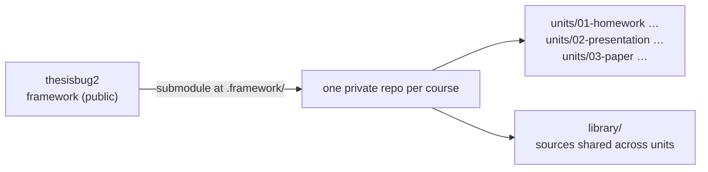

# thesisbug2

AI-agent framework for Traditional Chinese academic coursework — one repo per course, shared skills, audited sources.

> **Status: early port.** The architecture in [`docs/DESIGN.md`](docs/DESIGN.md) is settled and the 15 agent skills are in `.agents/skills/`. The scripts, templates, and `course-init` are not here yet, so the install steps below describe the intended flow and do not work today. The [roadmap](#roadmap) shows what exists.

## What it is

thesisbug2 is the working environment an AI coding agent (Claude Code, Codex, Antigravity) needs to help write graded academic work in Traditional Chinese: Quarto/XeLaTeX templates for papers, journal articles, theses, homework, and slide decks; agent skills for choosing a topic, acquiring and auditing sources, checking citations, terminology, and argument flow, and getting an external review; and gates that fail the build when a citation is not backed by a verified local full text.

It is the second generation of a private template that modelled each piece of coursework as a git branch of the template itself. That design meant cherry-picking every framework fix into every live branch, left successive assignments of one course unrelated to each other, and mixed framework files with coursework. thesisbug2 splits the two:



- **The framework is this repository.** A course mounts it as a git submodule at `.framework/`. Updating is a pull; coursework never writes into it, so an update cannot conflict with your writing.
- **One repository per course.** Every assignment is a *unit* directory under `units/`. Units of the same course share a source `library/`, so a source fetched and audited for the midterm is ready for the final.
- **The framework version is pinned per course.** A unit handed in last semester still rebuilds to the same PDF.

## Install

### Requirements

| Tool | Why | macOS |
| :--- | :--- | :--- |
| git, [GitHub CLI](https://cli.github.com/) (`gh auth login` done) | course repos are private GitHub repositories | `brew install git gh` |
| [Quarto](https://quarto.org/) + TinyTeX | PDF builds through XeLaTeX | `brew install quarto && quarto install tinytex` |
| librsvg | embeds SVG figures in PDF output | `brew install librsvg` |
| [uv](https://docs.astral.sh/uv/) | runs the Python scripts and their dependencies without a manual venv | `brew install uv` |
| An agent CLI: Claude Code, Codex, or Antigravity | the skills are written for these | see each vendor |

macOS and Linux only. Course repos rely on symlinks committed to git, which Windows handles only in developer mode, so Windows is not supported.

### Start a course *(planned — not implemented yet)*

```bash
git clone https://github.com/enstw/thesisbug2 ~/homework/thesisbug2
~/homework/thesisbug2/scripts/course-init 1142-asia-pacific-security
```

`course-init` will create `~/homework/1142-asia-pacific-security/`, write the course skeleton, mount this framework at `.framework/`, link the agent skill directories, and create a **private** GitHub repository for the course.

### Start a unit *(planned)*

```bash
cd ~/homework/1142-asia-pacific-security
.framework/scripts/unit-init --type paper --title "…" --author "…"
```

### Update the framework inside a course *(planned)*

```bash
./fw update        # pulls .framework/ and commits the new pinned version
```

### Clone a course on another machine

```bash
git clone --recurse-submodules https://github.com/<you>/1142-asia-pacific-security
```

This one works with plain git today: the submodule brings the framework back at the pinned version.

## Course repository layout

```
<course>/
├── AGENTS.md          # course context; points agents at .framework/AGENTS.md
├── COURSE.md          # instructor, citation style, requirements, schedule
├── STATUS.md          # one line per unit
├── .framework/        # this repository, as a submodule
├── library/           # references.bib + refs/ shared by two or more units
├── notes/             # lecture notes, transcripts
└── units/
    ├── 01-homework-<topic>/
    ├── 02-presentation-<topic>/
    └── 03-paper-<topic>/      # WORK.json, PROGRESS.md, paper.qmd, references.bib, refs/
```

A new source lands in the unit that fetched it. When a second unit wants to cite it, `refs promote <key>` moves it, with its audit history, into `library/`. The full rules are in [`docs/DESIGN.md`](docs/DESIGN.md) § Sources.

## Roadmap

- [x] Architecture written down — [`docs/DESIGN.md`](docs/DESIGN.md)
- [x] Design reviewed and settled
- [x] Agent skills ported and cleared for publication
- [ ] Quarto templates, CSL files, and protocols ported (protocols generalised first)
- [ ] Scripts rewritten for the unit layout (`unit-init`, `build`, two-tier bibliography)
- [ ] `course-init`, `fw update`, `refs promote`
- [ ] First real course run on the framework

## Contributing

The project is at the design stage and the design is the thing to comment on. Open an issue against a section of `docs/DESIGN.md`.

## License

MIT — see [`LICENSE`](LICENSE), with two exceptions that keep their own licenses: the bundled ENS Font is under the SIL Open Font License 1.1 ([`OFL.txt`](.agents/skills/house-style/assets/fonts/OFL.txt) beside the font files), and citation style files, once ported, remain CC-BY-SA as stated in each file's header.
