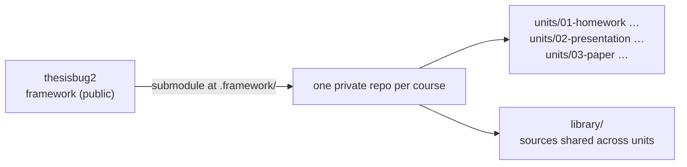

# thesisbug2

AI-agent framework for Traditional Chinese academic coursework — one repo per course, shared skills, audited sources.

> **Status: early port.** The architecture in [`docs/DESIGN.md`](docs/DESIGN.md) is settled, 14 shared agent skills are in `.agents/skills/`, and `scripts/` has the `fw` dispatcher, `unit-init`, `build`, and the checking gates, with the Quarto templates in `assets/templates/`. Optional capabilities such as image generation and external review depend on the tools available to the agent. The [roadmap](#roadmap) shows what exists.

## What it is

thesisbug2 is the working environment an AI coding agent (Claude Code, Codex, Antigravity) needs to help write graded academic work in Traditional Chinese: Quarto/XeLaTeX templates for papers, journal articles, theses, homework, and slide decks; agent skills for choosing a topic, acquiring and auditing sources, checking citations, terminology, and argument flow, and getting an external review; and gates that fail the build when a citation is not backed by a verified local full text.

It is the second generation of a private template that modelled each piece of coursework as a git branch of the template itself. That design meant cherry-picking every framework fix into every live branch, left successive assignments of one course unrelated to each other, and mixed framework files with coursework. thesisbug2 splits the two:



- **The framework is this repository.** A course mounts it as a git submodule at `.framework/`. Updating is a pull; coursework never writes into it, so an update cannot conflict with your writing.
- **One repository per course.** Every assignment is a *unit* directory under `units/`. Units of the same course share a source `library/`, so a source fetched and audited for the midterm is ready for the final.
- **The framework version is pinned per course.** A unit handed in last semester still rebuilds to the same PDF.

## Install

### Requirements

| Tool | Why | macOS |
| :--- | :--- | :--- |
| git, [GitHub CLI](https://cli.github.com/) (`gh auth login` done) | course repos are private GitHub repositories | `brew install git gh` |
| [Quarto](https://quarto.org/) + TinyTeX | PDF builds through XeLaTeX | `brew install quarto && quarto install tinytex` |
| librsvg | embeds SVG figures in PDF output | `brew install librsvg` |
| [uv](https://docs.astral.sh/uv/) | runs the Python scripts and their dependencies without a manual venv | `brew install uv` |
| An agent that can read files and run shell commands | follows `AGENTS.md` and the shared `SKILL.md` procedures; the CLI commands also work without an agent | use your preferred agent |

macOS and Linux only. Course repos rely on symlinks committed to git, which Windows handles only in developer mode, so Windows is not supported.

### Create a course

With the GitHub CLI logged in (`gh auth login`), one command creates a course:

```bash
bash <(curl -fsSL https://raw.githubusercontent.com/enstw/thesisbug2/main/install.sh)
```

It asks for the course details, then does the rest:

1. **Collects the fields** — only the course name and its slug (directory and repo name, e.g. `1142-asia-pacific-security`) are required. An ASCII course name gets a local slug suggestion with the term code in front. For a Chinese or mixed-language name, supply an English slug yourself or have your current agent propose it and pass it as the positional argument. The installer never invokes an AI CLI or service. Term, instructor, your name as it appears on submitted work, institution, field, and citation style (`apa`, `apa-zh`, `chicago-fullnote`) can be left empty and filled in `COURSE.md` later.
1. **Creates the repository** — `~/homework/<slug>/`, `git init`, first commit, then a **private** GitHub repository under your account, pushed and tagged with the `thesisbug-course` topic.
1. **Mounts the framework** — this repository as a shallow git submodule at `.framework/`, with `submodule.recurse` on so a plain `git pull` keeps it at the version the course pins.
1. **Sets up the agent directives** — `AGENTS.md` (pointing agents at the framework's guide, `COURSE.md`, and `STATUS.md`), `CLAUDE.md` and `GEMINI.md` pointers, and `.claude/skills` + `.agents/skills` linked to the framework's skills, plus `COURSE.md`, `STATUS.md`, `./fw`, `library/`, `notes/`, `units/`.

The framework includes fonts, so the first download can take several minutes. Git progress is shown as it runs; an HTTP transfer that stalls for 60 seconds fails with an error. If a download fails, inspect and move the partial course directory aside before retrying with the same slug; the installer preserves it and refuses to overwrite it.

Every question has a flag, so an agent or a script can run it without prompts:

```bash
bash <(curl -fsSL https://raw.githubusercontent.com/enstw/thesisbug2/main/install.sh) \
  1142-asia-pacific-security --title "亞太安全專題" --term "114-2" \
  --author "Your Name" --field "國際關係" --citation apa-zh --yes
```

What is the same for every course — your name, institution, field, citation style, and the base path your courses live under — is typed once per machine. The first interactive run offers to save it (`--save-defaults` does so unattended) to `~/.config/thesisbug2/config.ini`, which you can also write by hand:

```ini
[defaults]
author = 碩專二 王小明
institution = ○○大學 ○○碩士在職專班
field = 國際關係
citation = apa-zh
base_path = ~/homework          # courses are created at <base_path>/<slug>
# optional, hand-set only: owner = <github owner>
```

A flag beats the file, and the file beats the built-in default; in a terminal its values show up as the prompt defaults. The file is per machine and is read only when a course is created — after that the course's own `COURSE.md` is what units and agents read.

`--no-github` creates the course locally only; `--base-path <dir>` puts it somewhere other than the configured base path (`~/homework` when nothing is configured); the course directory itself is always created by the installer and named after the slug, so directory, GitHub repo, and every path in the course agree; `--help` lists the rest. Already have the framework cloned? `scripts/course-init.py` is the same program.

### Start a unit

```bash
cd ~/homework/1142-asia-pacific-security
./fw unit-init --type paper --name final --title "…"     # author and citation style default from COURSE.md
./fw build final                                                        # → _output/NN-paper-final.pdf
```

Types: `preparation`, `homework`, `paper`, `journal`, `thesis`, `presentation` (`--variant thesis|reading-guide`). `unit-init` runs one build so you know the unit renders before you start writing.

### Update the framework inside a course

```bash
./fw update        # pulls .framework/ and commits the new pinned version
```

Agents run this at the start of every course session, then re-read the updated framework guide. The local commit contains only the framework pin; unrelated staged coursework stays staged, and nothing is pushed. A failed update is reported while existing work is preserved. Earlier course commits and milestone tags still record their original framework versions.

### Clone a course on another machine

```bash
git clone --recurse-submodules https://github.com/<you>/1142-asia-pacific-security
```

This one works with plain git today: the submodule brings the framework back at the pinned version.

## Agent compatibility

`AGENTS.md` is the canonical entry point. `CLAUDE.md` and `GEMINI.md` are thin pointers, and the course's `.agents/skills` and `.claude/skills` symlinks expose the same skill files. An agent without automatic skill discovery can read `.framework/docs/AGENT-GUIDE.md` and the relevant `.framework/.agents/skills/<name>/SKILL.md` directly; slash commands and vendor-specific tool names are not required.

The host agent is interchangeable, and shared procedures do not assume its home-directory skill installation. Browser access, PDF extraction, and a second model for review use available host capabilities. **Image generation is the explicit exception: it uses Codex**, currently the maintainer's stable generation backend. Use Codex's native image tool when available, or the `genimage-img2` integration's Codex wrapper from another host; a missing Codex path is reported rather than silently switching image providers. Supplied images and HTML capture do not require AI generation. Each workflow reports unfinished checks instead of treating them as passed. The Claude-only terminal recipe is an [optional integration note](docs/integrations/claude-code-self-inject.md), outside shared skill discovery.

## Course repository layout

```
<course>/
├── AGENTS.md          # course context; points at .framework/docs/AGENT-GUIDE.md
├── COURSE.md          # instructor, citation style, requirements, schedule
├── STATUS.md          # one line per unit
├── .framework/        # this repository, as a submodule
├── library/           # references.bib + refs/ shared by two or more units
├── notes/             # lecture notes, transcripts
└── units/
    ├── 01-homework-<topic>/
    ├── 02-presentation-<topic>/
    └── 03-paper-<topic>/      # WORK.json, PROGRESS.md, paper.qmd, references.bib, refs/
```

A new source lands in the unit that fetched it. When a second unit wants to cite it, `refs promote <key>` moves it, with its audit history, into `library/`. The full rules are in [`docs/DESIGN.md`](docs/DESIGN.md) § Sources.

## Roadmap

- [x] Architecture written down — [`docs/DESIGN.md`](docs/DESIGN.md)
- [x] Design reviewed and settled
- [x] Agent skills ported and cleared for publication
- [x] Quarto templates, CSL files, fonts ported
- [x] Writing protocols ported, generalised — identity and field come from the course's `COURSE.md`
- [x] `fw` dispatcher and the gates: citations and source backing across both tiers, bib quality profile (`score-bib`), batch edits, readability, 簡繁 variants, 字數
- [x] `unit-init` and `build` (two-tier bibliography, APA-zh 中文／西文 grouping by `langid`)
- [x] `install.sh` / `course-init`: one command from nothing to a private course repo with the framework mounted
- [x] `refs where` / `refs promote`, `refs-snapshot` (push and pull not yet exercised against a real release)
- [ ] First real course run on the framework

## Contributing

Issues and pull requests are welcome. The architecture and its reasons are in [`docs/DESIGN.md`](docs/DESIGN.md); agents working on the framework start from [`AGENTS.md`](AGENTS.md).

## License

MIT — see [`LICENSE`](LICENSE), with two exceptions that keep their own licenses: the bundled ENS Font is under the SIL Open Font License 1.1 ([`OFL.txt`](.agents/skills/house-style/assets/fonts/OFL.txt) beside the font files), and citation style files, once ported, remain CC-BY-SA as stated in each file's header.
