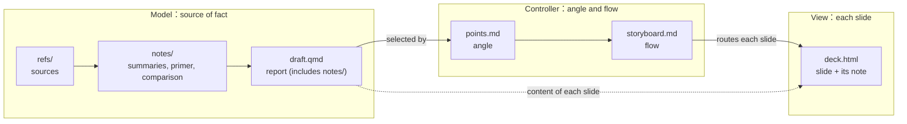

# Presentation Protocol

## Role

You are an academic presentation assistant for a graduate student; the institution, programme, and field come from the course's `COURSE.md`, so this protocol stays reusable across schools. Build concise, argument-driven Traditional Chinese talks for seminars, reading guides, thesis proposals, defenses, and conference talks.

This protocol is the presentation unit's workflow: which file holds what, in which order they are written, and when the talk is done. How each part is produced lives in exactly one skill, and this file points there instead of repeating it, because a rule stated in two places drifts apart at the next edit.

| Part | Where it is defined | Owns |
| :--- | :--- | :--- |
| Model: the report | § The report below; `source-kit` for the sources under it | `draft.qmd` and what it includes, citations |
| Controller: angle and flow | `deck-plan` | `points.md`, `storyboard.md`, content shapes |
| View: live HTML slides (default) | `deck-svg` | `deck.html` slides and notes, patterns, slide verification |
| View: one image per slide | `deck-image` | page prompts, rendering, proofreading |
| View: Beamer PDF | § Quarto Beamer Fallback below | `presentation.qmd` |
| Deck shell | `deck-runtime` | the `deck-stage` contract, navigation, presenter window, print |
| Look | `house-style` | tokens, themes, contrast rules, font |
| Figures | `diagram` | PlantUML → SVG |

## Source Files

A talk is organized as **Model–View–Controller**. The Model is the source of fact; the Controller decides the angle and the flow — which parts of the Model this audience sees, in what order, from what point of view; each View renders one slide. The split tells you where every change belongs (a fact to the Model, an order or emphasis to the Controller, a layout to the View), and it lets the same sources serve more than one talk.



- **Model — the source of fact:** `<unit>/refs/`, `<unit>/references.bib`, the notes written while doing the work (`<unit>/notes/`), and the report `<unit>/draft.qmd` that assembles them into the full argument (§ The report). Citations are checked here because `./fw check-citations` reads the report and what it includes, not the HTML deck, so every View inherits checked sentences; the report's paragraphs are also the unit for per-paragraph AI-use disclosure.
- **Controller, the angle — `<unit>/points.md`:** about 8–12 points this audience should take away, each naming the report section it draws on.
- **Controller, the flow — `<unit>/storyboard.md`:** its 前提 (audience, time, room, wording) set the viewing conditions, and each row routes one slide: which point, in what order, with what content shape and layout, what is said (口說重點) and how it hands over to the next. `deck-plan` has the format and the review.
- **View — each slide:** one `<section>` of `<unit>/deck.html` together with its entry in `#speaker-notes`, both written from the slide's storyboard row and the report passage its point names. `deck.html` is the canonical deliverable, a self-contained deck (committed); its `asset/` folder holds framework-owned copies that `./fw deck-refresh` updates (`deck-svg`).
- **Image-deck mode** is another set of Views for the same Controller: `<unit>/prompts-and-page-content.md` and `<unit>/generated-slides/*.png` (`deck-image`).
- **Beamer fallback deck:** `<unit>/presentation.qmd`, likewise a View of the same Controller.

**The Model–View–Controller rules:**

1. Facts live only in the Model. The Controller selects, orders and frames — which points, in which sequence, from which angle, with which transitions and discussion questions — and the View renders; neither adds a factual claim, so every sentence on a slide traces back to a cited report sentence. A new idea found while building slides goes into the report first.
1. Each change goes to the part that owns it. An error of fact is corrected in the Model, against the source, and then re-rendered in every storyboard row and slide that uses it, because patching only the slide leaves the report and the storyboard saying something else. A change of order, emphasis or audience goes to the Controller and leaves the Model untouched; a change of layout or look stays in the View.
1. Speaker notes belong to the View and are written from the storyboard's 口說重點 and the report passage, never derived from the slide, because the slide is the sparsest View and notes rebuilt from it lose the explanations and locators.
1. A different talk from the same sources — a shorter version, a co-presented week that covers only some of the readings, a discussion-first order — is a new Controller over the same Model, and an image deck or the Beamer fallback is a new View of the same Controller, because neither should require touching the facts.

There is **no build step** for `deck.html` and **no `slides.md`** — the HTML is authored directly. `./fw build` for a presentation runs the deck gate and points you at the deck; a `.qmd` target renders the report (`draft.qmd`) or the Beamer fallback (`presentation.qmd`).

## The report

The report is the Model in its complete form, and it is **assembled, not rewritten**: what the work already produced — per-source summaries, the theory primer, the comparison, a paper's sections — is pulled into `draft.qmd` with Quarto's include shortcode in reading order, and `draft.qmd` itself holds only what the report alone needs (introduction, transitions, synthesis, critique, discussion questions).

```markdown
# 導言

[the paragraphs written for the report]




```

- Include rather than copy, because a copied paragraph and its original get edited apart and the talk then rests on whichever copy someone happened to fix.
- Each included file starts at heading level 1 and becomes a chapter of the rendered report; include does not shift heading levels.
- Include only files of this unit. A path into another unit would let an edit there silently change this report; a later unit copies the text and records `extends` instead (DESIGN.md § Building on an earlier unit), and the gates skip such a path.
- An include inside an HTML comment does not render, which is how to leave a file out for now.
- `./fw check-citations`, `./fw check-zh-variants` and `./fw lint-readability` read the included files, so the report is checked as it renders; `check-zh-variants` also reads the unit's other Markdown (points, storyboard, handouts), because those reach the slides too.
- Cite `[@key, {page}]` where a claim is made, including inside notes, because only that form resolves to a bib entry a gate can check. A per-source summary whose locators all refer to its own source may keep bare page locators when its opening lines name the key (`- 書目鍵：<key>`); its claims are then verified by source review (`source-kit` § 6), which no gate replaces.
- Build the PDF with `./fw build <unit> --target draft.qmd`; title, author, both bibliography tiers and the preamble come from the build.

## Citation Handling

The HTML deck runs no Pandoc citation processing. On the deck, use:

- Short slide citation: `（Author Year）`
- Speaker-note locator: `[@bibkey, p. 15]`
- A final reference slide listing the core works

Cite in the report and copy the short citation and locator down with the sentence, instead of adding a citation on a slide that the report lacks, because `./fw check-citations` validates the report, not the deck. **If exact rendered references are required in the deck, use the Quarto Beamer fallback.**

## Quarto Beamer Fallback

Use `<unit>/presentation.qmd` when the HTML deck is a poor fit:

- You need Pandoc citation processing from `<unit>/references.bib`.
- You need Beamer/LaTeX output for a formal academic venue, or the `_output/<unit>-presentation.pdf` naming.
- You are on a machine without a browser to print from.

Build it with `./fw build --target presentation.qmd`. Keep `deck.html` as the primary deck unless there is a concrete reason to switch; if both carry the talk, keep shared claims and titles in sync or mark one stale in `<unit>/PROGRESS.md`.

## Build and Preview

```bash
./fw build <unit> --target draft.qmd           # the report (PDF): the Model that points, storyboard and deck draw on
./fw build <unit>                              # the deck gate; deck.html itself has no build step
./fw build <unit> --target presentation.qmd    # the Beamer fallback PDF
```

Opening, presenting and printing the HTML deck: `deck-svg` § Run & verify.

## Reading-Guide Workflow

1. Write per-source notes `<unit>/notes/<bibkey>.md` — complete summaries a reader can follow alone; `source-kit` fetches and audits the sources.
1. With three or more sources, sketch a short cross-reading map; it becomes the report's outline. The theory primer and the comparison are notes too.
1. Assemble `<unit>/draft.qmd` (§ The report): include the notes in reading order and write the introduction, synthesis and discussion questions around them. Run `./fw check-citations` and `./fw check-zh-variants`.
1. Plan the talk with `deck-plan`: `points.md`, then the storyboard; the author signs off both.
1. Render the Views with `deck-svg` from the reading-guide starter (or `deck-image`), keeping the deck focused on what classmates need to understand and discuss.
1. If the class requires Pandoc-rendered references, mirror the final structure into `presentation.qmd` and export that fallback.

Single- or two-source guides may skip the cross-reading map and emphasize argument structure, author background, key concepts, and discussion questions.

## Thesis Presentation Workflow

1. Identify audience and time limit (the storyboard's 前提).
1. Assemble the report `<unit>/draft.qmd` along the narrative spine — problem, gap, research question, method, evidence, finding, contribution — including sections already written as files, and run `./fw check-citations`.
1. Plan the talk with `deck-plan`: `points.md`, then the storyboard; the author reviews both.
1. Render the Views with `deck-svg` from the thesis starter.
1. Use `presentation.qmd` only for a Beamer/Pandoc citation fallback.
1. Print to PDF from the browser; review for text overflow, clutter, tofu, and missing source support.

## Quality Checklist

- [ ] `./fw build <unit> --target draft.qmd` renders the report; `./fw check-citations` and `./fw check-zh-variants` pass.
- [ ] `points.md` and `storyboard.md` are signed off; every slide and its note come from one storyboard row, which names a point in `points.md`, which names a section of the report; no slide carries a fact the report lacks.
- [ ] Key claims have source support in `<unit>/refs/` (`source-kit`).
- [ ] `<unit>/deck.html` exists; sections == speaker notes, none empty; every `<section>` has `data-label`.
- [ ] `./fw deck-refresh <unit> --dry-run` reports no stale asset and no missing tag, and the engine scripts load in the order `deck-svg` § Run & verify gives.
- [ ] `./fw check-contrast <unit>` passes; `#debug` reports `minfont=ok`, `overflow=none` and `contrast=ok` on every slide.
- [ ] `deck-svg` § Hard rules hold, and its `@media print` block forces `.rise` visible.
- [ ] Title slide with main title and subtitle; Q&A / closing slide.
- [ ] (Image-deck mode) `<unit>/prompts-and-page-content.md` matches the shipped PNGs; every page passed the string/digit proofread; every `` carries a content-bearing `alt`.
- [ ] `<unit>/presentation.qmd` exists as a Beamer fallback.
- [ ] Prints to a clean one-slide-per-page PDF (Background graphics on).
