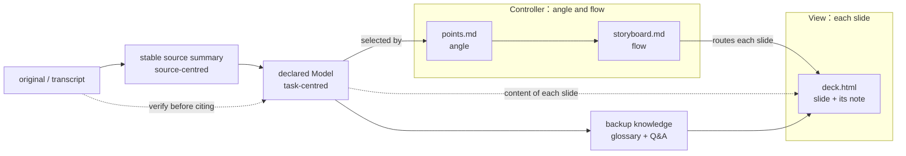

# Presentation Protocol

## Role

You are an academic presentation assistant for a graduate student; the institution, programme, and field come from the course's `COURSE.md`, so this protocol stays reusable across schools. Build concise, argument-driven Traditional Chinese talks for seminars, reading guides, thesis proposals, defenses, and conference talks.

The framework owns both reusable workflows behind a talk: `source-kit` owns
original → identity-checked, stable per-source summary; this protocol owns
stable summaries/originals → task-focused Model → backup knowledge →
Controller → View. A course repo stores each workflow's instance, constraints
and current state; it does not redefine the generic workflow in `COURSE.md` or
a unit decision file.

| Part | Where it is defined | Owns |
| :--- | :--- | :--- |
| Stable source summary | `source-kit` § Stable per-source summary | `<unit>/notes/<key>.md` |
| Presentation Model | § Choosing the Model | `guide.qmd`, `paper.qmd`, or files declared by `talk.json` |
| Backup knowledge | § Speaker notes | `<unit>/notes/glossary.md`, `<unit>/notes/qa.md` |
| Controller: angle and flow | `deck-plan` | `<talk>/points.md`, `<talk>/storyboard.md`, content shapes |
| View: live HTML slides (default) | `deck-svg` | `<talk>/deck.html` and delivery notes, patterns, slide verification |
| View: one image per slide | `deck-image` | page prompts, rendering, proofreading |
| View: Beamer PDF | § Quarto Beamer Fallback below | root presentation unit's `presentation.qmd` |
| Deck shell | `deck-runtime` | the `deck-stage` contract, navigation, presenter window, print |
| Look | `house-style` | tokens, themes, contrast rules, font |
| Figures | `diagram` | PlantUML → SVG |

## Source Files

A talk is organized as **Model–View–Controller**, downstream of the stable
source summaries defined by `source-kit`. The summary and Model are not two
versions of one draft: the summary represents one work and stays source-centred;
the Model answers the assignment or talk's question and may select, compare and
frame several summaries after checking the original passages.

`<unit>` is the assignment directory containing `WORK.json`. `<talk>` is one
occasion-specific presentation. A presentation unit is a single talk, so
`<talk> == <unit>`. A paper, thesis or other assignment keeps each occasion at
`<unit>/talks/<occasion>/`, created without copying its manuscript:

```bash
./fw talk-init <unit> --name week16-seminar --model paper.qmd --variant thesis
```

Every new talk carries `talk.json`; its `model` paths are relative to the unit:

```json
{"title":"期末研討會","variant":"thesis","model":["paper.qmd"]}
```



- **Model:** the file(s) declared by `talk.json`. A reading guide uses
  `guide.qmd`, organized around the week's problem; a paper/thesis talk uses
  its actual staged deliverable or manuscript (`research-question.qmd`,
  `theory-design.qmd`, `paper.qmd`, etc.), not a presentation copy.
- **Backup knowledge:** `<unit>/notes/glossary.md` and `notes/qa.md`. It expands
  what the presenter must understand but need not appear in the submitted
  paper. Citation and language gates read these fixed paths directly.
- **Controller:** `<talk>/points.md` selects about 8–12 takeaways, each naming
  a Model section; `<talk>/storyboard.md` fixes audience, order, content shape,
  on-slide copy, spoken points, backup entries and AI disclosure.
- **View:** `<talk>/deck.html` and `<talk>/speaker-notes.md`. Its frozen engine,
  look and runtime live in `<talk>/asset/`; `deck-refresh` updates only those
  framework-owned copies.

**The Model–View–Controller rules:**

1. On-slide facts and claims live in the declared Model. Backup-only
   explanations live in the cited unit glossary/Q&A. The Controller selects,
   orders and frames; the View renders without inventing either. A new factual
   idea found while building a slide goes into the Model first.
1. An error is corrected against the original in its owning factual layer
   (Model or backup knowledge), then re-rendered downstream. An order, emphasis
   or audience change belongs to the Controller; a layout or look change
   belongs to the View.
1. Delivery (講法) is View. Glossary and answers are factual backup shared by
   every talk in the unit and checked upstream; the storyboard chooses which
   entries this audience needs.
1. A different occasion gets a new talk directory over the same Model, not a
   copied manuscript. An image deck is another View of the same Controller.

There is **no build step** for `deck.html` and **no `slides.md`**. `./fw build
<talk>` runs the deck gate. A root presentation unit may also build its Model
or Beamer fallback as a `.qmd` target; an attached talk builds its assignment
manuscript through the owning unit.

## Choosing the Model

`talk.json` is authoritative. `deck-plan` reads every listed file as it
renders, including local Quarto includes.

- **Reading guide:** `guide.qmd` is written around the week's common problem:
  required theory → each reading's relevant argument → comparison and critique
  → factual basis for discussion. It selects from stable summaries, verifies
  the original passage, and cites `[@key, {page}]`. It never rewrites the
  summaries merely to fit the talk.
- **Paper/thesis talk:** declare the submitted manuscript or relevant staged
  document itself. Do not author a second presentation report.
- **Several files:** declare more than one only when they are genuinely
  separate authoritative deliverables; list them in reading order.

Quarto includes remain useful inside a Model to assemble sections without
copying. They stay within the unit, because a cross-unit include lets later
work silently change an already-graded assignment. `check-citations`,
`check-zh-variants` and `lint-readability` follow local includes.

## What a reading guide covers

A reading guide teaches a new reader how each work is built, who wrote it and
where it sits, and what its words mean, then puts the works to use. Each part
is written once, in the layer that owns it, so the slides and notes only
select and say it:

| Content | Written in | Reaches the talk as |
| :--- | :--- | :--- |
| Paper skeleton: question, gap, claims and hypotheses, argument steps, evidence, limits, how the piece is written | the stable summary's 論文骨架 (`source-kit` template) | the argument slides, selected through the Model |
| Author and field position: affiliation, related earlier work, school and contribution | the summary's 作者與學術位置, restated with citations in the Model's `### 作者與學術位置` under each reading | a spoken introduction at the start of that reading's part; no extra slide needed |
| Technical terms and abbreviations | `<unit>/notes/glossary.md` | the storyboard's 名詞與提問 column; `./fw deck-notes` adds each one-line version to the note |
| Critique and discussion questions | the Model's comparison and discussion sections | the critique and discussion slides |
| Recent events that test the readings (optional) | the Model's `# 近年局勢檢驗`, sources in the unit tier | one timeline slide; a new question gets its own slide |

**Author introductions.** Take the affiliation from the work itself (its first
page or author note) and the field position from cited literature, including
the course's other readings when they discuss the author. A line that
characterizes the contribution in the presenter's words is marked as the
presenter's, on the page and aloud.

**Terms and abbreviations.** Every technical term or abbreviation that appears
on a slide, or in the spoken notes, and that this audience may not know gets a
glossary entry and is listed in that slide's 名詞與提問. `deck-notes` checks
that a listed entry exists; it cannot tell a term was left off the list, so
check coverage slide by slide when signing off the storyboard. Name an
abbreviation's entry 全名（縮寫）, and spell the abbreviation out at its first
use in the Model and on its first slide.

**Recent-events test (optional).** Current events can test a reading in front
of the class. Map each event to the discussion question it tests, and say on
the slide that the mapping is the presenter's link, which points to what is
worth checking and neither confirms nor refutes the theory. New sources land in
the unit tier with an identity audit (`source-kit` §0, §8). A disputed fact is
written as the claim of the party that makes it, a figure carries its date,
and a status that may change before the talk carries its source date. Do not
reword discussion questions already distributed to the class; add a new one
under the next number and mark it as added.

Run `./fw check-citations <unit>` and `./fw check-zh-variants <unit>` before
planning. A good source summary speeds relevance judgment and locator lookup,
but citation support is still verified against the original (`source-kit`).

## Speaker notes

The presenter may not know every detail behind a slide, and the audience asks about exactly those details. So a speaker note carries the presenter's backup knowledge as well as the talk:

| Part of the note | Written in | Owner |
| :--- | :--- | :--- |
| 【講法】 what to say, in order, with timing, transitions and where to ask the room | `<talk>/speaker-notes.md`, one `## <n>｜<label>` section per slide | View |
| 【名詞】 the terms on this slide, one line each | `<unit>/notes/glossary.md`, one `## <term>` section per term | factual backup |
| 【提問】 questions this audience is likely to ask, with a short answer | `<unit>/notes/qa.md`, one `## Q<n> <question>` section per question | factual backup |
| which terms and questions each slide carries | `<talk>/storyboard.md` 名詞與提問 | Controller |

- Glossary and Q&A entries open with a one-line version (`**一句話**` / `**簡答**`, cited); the rest of the entry is the full explanation. Citation and language gates read both files directly, so they do not need to be artificial appendices to a submitted paper. The presenter reads the full entries before the talk; the note carries only the one-line versions, because on stage there is time for a glance, not a paragraph.
- A term is written once and serves every slide that names it; a question an audience will ask but the readings do not answer is answered as "the text does not address this", never with an invented answer, because the presenter will say it aloud.
- `./fw deck-notes <talk> --init` seeds `speaker-notes.md` from the storyboard's 口說重點; `./fw deck-notes <talk>` writes the assembled notes into `deck.html`. It refuses — and writes nothing — when a section's number or label no longer matches its slide or a row names a term or question the unit glossary/Q&A lacks. `./fw build <talk>` runs the same check on a `speaker-notes.md` that `--init` created, so a note edited only in `deck.html` is caught before the next assembly overwrites it.

## Citation Handling

The HTML deck runs no Pandoc citation processing. On the deck, use:

- Short slide citation: `（Author Year）`
- Speaker-note locator: `[@bibkey, p. 15]` (`./fw deck-notes` turns a Model entry's `[@key, {15}]` into this form)
- A final reference slide listing the core works

Cite in the declared Model and copy the short citation and locator down with
the sentence, instead of adding a citation only on a slide: `check-citations`
validates the Model and unit backup files, not the HTML deck. **If exact
rendered references are required in the deck, use the Quarto Beamer fallback.**

## Quarto Beamer Fallback

In a root presentation unit, use `<unit>/presentation.qmd` when the HTML deck is a poor fit:

- You need Pandoc citation processing from `<unit>/references.bib`.
- You need Beamer/LaTeX output for a formal academic venue, or the `_output/<unit>-presentation.pdf` naming.
- You are on a machine without a browser to print from.

Build it with `./fw build <unit> --target presentation.qmd`. Attached talks
are HTML-first; their assignment manuscript builds through the owning unit.

## Build and Preview

```bash
./fw check-citations <unit>                    # Model + glossary/Q&A
./fw check-zh-variants <unit>
./fw build <talk>                              # deck gate; deck.html itself has no build step
./fw deck-refresh <talk> --dry-run
./fw check-contrast <talk>
```

Opening, presenting and printing the HTML deck: `deck-svg` § Run & verify.

## Reading-Guide Workflow

1. Use `source-kit` to acquire, identify, summarize and verify every assigned
   reading. Each complete summary is reviewed against the original before
   presentation work and remains stable while that reading remains correct.
1. Write `<unit>/guide.qmd` around the week's problem, selecting from the
   summaries and verifying/citing the original passages. This is the declared
   Model; summaries are not included wholesale or rewritten for the talk.
   Open each reading's section with `### 作者與學術位置` (§ What a reading
   guide covers).
1. Expand unit-level glossary and Q&A from knowledge the Model requires,
   checking their factual content directly against sources. Cover every term
   and abbreviation the slides and notes will use.
1. Plan the talk with `deck-plan`: `<talk>/points.md`, then the storyboard;
   the author signs off both.
1. Render the Views with `deck-svg` (or `deck-image`), write delivery notes,
   assemble them with `./fw deck-notes <talk>`, then run the deck checks.
1. If the class requires Pandoc-rendered references, mirror the final structure into `presentation.qmd` and export that fallback.

Single- or two-source guides may skip the cross-reading map; the paper skeleton, author introduction, terms and discussion questions still apply.

## Thesis Presentation Workflow

1. Keep writing the assignment's required documents; they are the Model.
1. Add an occasion with `talk-init`, declaring the relevant document(s), and
   identify audience and conditions in its storyboard premises.
1. Expand shared glossary/Q&A only for knowledge the presenter may need.
1. Plan, render and verify the talk without changing the manuscript merely to
   suit its duration or layout.
1. Tag the version used when the talk is delivered, because the manuscript may
   continue changing afterward.

## Quality Checklist

- [ ] Stable summaries identify their source/edition, open with 論文骨架 and 作者與學術位置, preserve argument and evidence with locators, and were reviewed against the original.
- [ ] (Reading guide) Each reading's author is introduced from cited sources; every term and abbreviation on a slide or in a note has a glossary entry listed in that slide's 名詞與提問.
- [ ] `talk.json` names the actual task-focused Model; no per-talk copy of the assignment manuscript exists.
- [ ] `./fw check-citations <unit>` and `./fw check-zh-variants <unit>` pass, including glossary and Q&A.
- [ ] `<talk>/points.md` and `storyboard.md` are signed off; every slide and note trace to the declared Model and add no factual claim.
- [ ] Key claims have source support in `<unit>/refs/` (`source-kit`).
- [ ] `<talk>/deck.html` exists; sections == speaker notes, none empty; every `<section>` has `data-label`; `./fw deck-notes <talk> --check` passes.
- [ ] `./fw deck-refresh <talk> --dry-run` reports no stale asset and no missing tag, and the engine scripts load in the order `deck-svg` § Run & verify gives.
- [ ] `./fw check-contrast <talk>` passes; `#debug` reports `minfont=ok`, `overflow=none` and `contrast=ok` on every slide.
- [ ] `deck-svg` § Hard rules hold, and its `@media print` block forces `.rise` visible.
- [ ] Title slide with main title and subtitle; Q&A / closing slide.
- [ ] (Image-deck mode) `<talk>/prompts-and-page-content.md` matches the shipped PNGs; every page passed the string/digit proofread; every `` carries a content-bearing `alt`.
- [ ] A root presentation unit has `presentation.qmd` when a Beamer fallback is actually needed.
- [ ] Prints to a clean one-slide-per-page PDF (Background graphics on).
