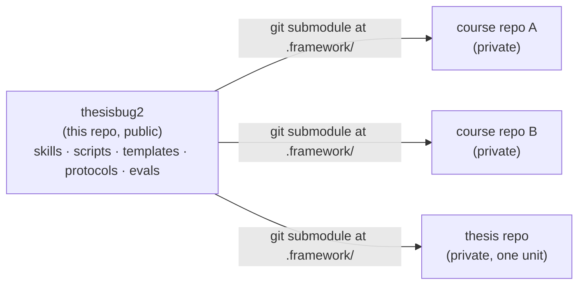
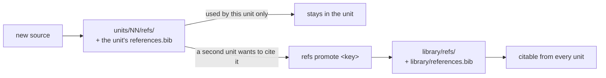

# thesisbug2 — design

Status: **draft for review**, 2026-09-18. Nothing below is implemented yet. Decisions marked *Decided* were agreed with the maintainer; items under § Open questions are not.

## Why a second generation

`thesisbug-template` models each piece of coursework as a permanent git branch of the template repo. Framework files and coursework share one history, and that single fact causes three recurring problems:

1. **Frequent cherry-picks.** Every framework fix on `main` has to be cherry-picked into each live work branch, and conflicts land in files the author never touched.
1. **No continuity inside a course.** A midterm paper and the final paper for the same course are unrelated branches. Sources fetched and audited for one are invisible to the other.
1. **Everything is mixed together.** Infrastructure, agent workflow, source transcripts, status logs, and agent directions live side by side in one tree, so neither a human nor an agent can tell at a glance which files are the framework's and which are the author's.

thesisbug2 separates the two histories. The framework becomes its own repository. Coursework lives in one repository **per course**, which mounts the framework read-only and updates it with a pull.

## Goals and non-goals

Goals:

1. Updating the framework inside a course is one command and never produces a merge conflict with coursework.
1. Successive units of one course share a source library, including the audit verdicts already earned.
1. A course repo's tree makes ownership obvious: framework files are under one directory that coursework never writes to.
1. A unit handed in last semester still rebuilds to the same PDF, because the course repo records which framework version it used.
1. Every agent workflow (skills, protocols, gates, evals) ships with the framework, so a new course starts with the full toolchain.

Non-goals:

1. Migrating the existing `thesisbug-template` work branches. They keep working on the old template; nothing forces a move.
1. A cross-course personal library. Sources are shared within a course only. Revisit when the same source is demonstrably re-fetched across courses.
1. Backward compatibility with the `work/` + `WORK.json`-at-repo-root layout.

## The two kinds of repository



*Decided:* the framework is mounted as a **git submodule** at `.framework/` in each course repo.

Alternatives considered:

| Option | Why not |
| :--- | :--- |
| A gitignored nested clone in each course | Cloning the course on another machine does not bring the framework back, and nothing records which framework version a unit was built with. |
| One shared framework checkout per machine | A change to the preamble or a CSL file would silently alter the output of units already handed in. |
| Git subtree | Puts framework history back into the course repo, which is the mixing this design exists to remove. |

The submodule pins a framework commit in the course repo. That pin is what makes goal 4 hold. Updating is `git -C .framework pull` followed by committing the new pointer; a wrapper (`./fw update`) does both. `course-init` sets `submodule.recurse=true` locally so an ordinary `git pull` of the course also moves `.framework/` to the pinned commit.

Framework fixes discovered during coursework are made **inside `.framework/`** (it is a full clone), committed, and pushed to thesisbug2. Other courses receive them on their next update. This replaces cherry-picking.

## Course repository layout

*Decided:* one git repository per course, `main` only, private.

```
<course>/
├── AGENTS.md                    # thin: course context + pointer to .framework/AGENTS.md
├── COURSE.md                    # instructor, citation style, grading requirements, schedule
├── STATUS.md                    # course-level index: one line per unit
├── .framework/                  # submodule — coursework never writes here
├── .agents/skills -> .framework/.agents/skills     # committed symlink (Codex, agy)
├── .claude/skills -> .framework/.agents/skills     # committed symlink (Claude Code)
├── library/                     # sources shared by two or more units
│   ├── references.bib
│   └── refs/   { <key>.md, audit/<key>.jsonl, archive/, MANIFEST.tsv }
├── notes/                       # lecture notes, transcripts, non-cited material
├── units/
│   ├── 01-homework-<topic>/     { WORK.json, PROGRESS.md, homework.qmd }
│   ├── 02-presentation-<topic>/ { WORK.json, PROGRESS.md, deck.html, asset/ }
│   └── 03-paper-<topic>/        { WORK.json, PROGRESS.md, paper.qmd, chapters/, references.bib, refs/ }
└── _output/                     # gitignored build products, named after the unit
```

Rules:

1. **A unit is a directory that contains `WORK.json`.** Scripts locate the current unit by walking up from the working directory to the nearest `WORK.json`, the way git finds `.git`. Skills say "the unit directory" instead of `work/`.
1. **Unit names are `NN-<type>-<topic>`.** The number gives chronological order; the type is one of `preparation`, `homework`, `paper`, `journal`, `presentation`, `thesis`.
1. **Status has two levels.** `STATUS.md` is the course index. Each unit's `PROGRESS.md` is the working log for that unit.
1. **A thesis is a course repo with one unit.** No special case.
1. **Milestone tags** are `<unit>/<label>`, for example `03-paper-final/draft-v1`.
1. **Committed symlinks** replace `link-skills.sh`. Both agent skill directories point into the submodule, so a framework update updates every agent's skills at once. Symlinks in git need developer mode on Windows; *decided:* Windows is unsupported, and the README says so.

### How skills and scripts name paths

*Decided:* agent sessions start at the course root, and every command is run from there through one dispatcher:

```bash
./fw <command> [<unit>] [options]     # e.g. ./fw check-citations units/03-paper-final
./fw update                           # pull .framework/ and commit the new pin
```

`fw` is a small script `course-init` writes at the course root; it forwards to `.framework/scripts/<command>`. When `<unit>` is omitted, the unit is the nearest `WORK.json` above the working directory; from the course root with no unit given, `fw` lists the units and exits, so nothing acts on the wrong unit by accident.

Skills write unit paths with a literal `<unit>/` prefix (`<unit>/refs/<key>.md`, `<unit>/references.bib`) and shared paths as `library/…`. A source's transcript is therefore `<unit>/refs/<key>.md` until it is promoted and `library/refs/<key>.md` after; skills say "the source's `refs/<key>.md`" where either may apply.

### Building on an earlier unit

*Decided:* a handed-in unit is frozen. A later unit that builds on it **copies** the text it wants to reuse and records the lineage; it never includes the earlier file live.

1. The later unit's `WORK.json` carries `"extends": "<earlier-unit>"`, and its `PROGRESS.md` notes what was carried over.
1. No Quarto `include` across units: editing the final paper must not be able to change what the midterm, already graded, rebuilds to.
1. Sources carry over through `refs promote`, not by copying transcripts.
1. When the later unit cites the earlier one as a work, the earlier unit gets an ordinary bib entry (unpublished manuscript) in `library/references.bib`.

### Working in parallel

Branch-per-work gave isolation for free; a single `main` does not. Unit directories do not overlap, and per-key audit logs never conflict, so the realistic collision is two agents appending to the same `references.bib`. When two units genuinely need simultaneous agents, use `git worktree`. This is a known cost of the design, accepted because it is rare.

## Sources: two tiers, one home per source

*Decided:* a source's files exist in **exactly one place** within a course repo — either one unit's `refs/` or `library/refs/`.



Rules:

1. **New sources land in the unit.** Topic scouting and literature scans pull in many sources that are never cited. Defaulting to the library would bury the shared sources in noise.
1. **Keys are unique across the whole course repo.** `check-citations` fails when a key appears in two units, or in a unit and the library, and tells the author to promote. This is how a duplicate fetch is caught.
1. **`./fw refs promote <key>` moves everything that belongs to the key** — the bib entry, `<key>.md`, `audit/<key>.jsonl`, any original under `archive/` — into `library/`, with `git mv` so history follows. It validates before it touches anything. When the key already sits in more than one place (a duplicate fetch), it keeps one copy and merges the audit logs line by line, because every line is a judgment someone made; it refuses when the transcripts differ, since two transcripts of one key usually means one is the wrong document. `./fw refs where <key>` shows a key's home and which units cite it.
1. **Assigned course readings go straight into `library/`.** They will be cited by more than one unit.
1. **The two verdict kinds have different scope.**
   - `identity` (is this file the cited work itself?) is a fact about the source. After promotion every unit inherits it; nothing is re-audited.
   - `support` (does the source back this claim?) is about one claim in one unit. Every `support` line carries a `unit` field, and `check-bib` for unit U counts only lines where `unit == U`.
1. **Builds read both tiers.** `build` writes the unit's `_quarto.yml` with `bibliography: [<course>/library/references.bib, references.bib]`. Lookup order is unit first, then library.
1. **The quality ratchet is per unit.** `required_bib_level` lives in the unit's `WORK.json`. The library has no level of its own; `check-bib --library` reports its overall state.
1. **Units without citations have no `refs/`.** It is created on the first fetch.
1. **Originals are not in git.** `./fw refs-snapshot` keeps one GitHub Release per course repo (tag `refs`; the old template kept one per branch), pinned by a single committed manifest, `library/refs/MANIFEST.tsv`, that covers both tiers with paths relative to the course root. A release asset is named after the file alone (`<key>.pdf`) — keys are unique across the course — so promoting a source rewrites its manifest path without re-uploading anything.

## Course repos on GitHub

| Item | Convention | Reason |
| :--- | :--- | :--- |
| Visibility | always private | `refs/<key>.md` are full-text transcripts of copyrighted works |
| Name | `<term>-<course>`, e.g. `1142-asia-pacific-security` | sorts chronologically |
| Topic | `thesisbug-course` | `gh repo list --topic thesisbug-course` enumerates every course for a pull-all script |
| Framework | submodule at `.framework/`, HTTPS URL | works with the maintainer's existing credential setup; the framework is public, so no credential is needed to read it |
| End of term | GitHub *Archive* (read-only) | frozen but still cloneable; the pinned submodule keeps it rebuildable |

`install.sh` (a one-line `curl` from the README) checks prerequisites and runs `scripts/course-init.py`, which creates a course in one command. It prompts for each field in a terminal and takes every field as a flag, so agents can run it unattended. Only the course name and the slug are required. Fields that do not change from course to course (author, institution, field, citation style, and by hand `parent` and `owner`) default from a per-account file, `~/.config/thesisbug2/config.ini`, with precedence flag > file > built-in. The file is machine-local and is read only at course creation; from then on `COURSE.md`, which is committed and travels with the course, is the single source for units and agents, so two machines with different account files cannot make one course disagree with itself.

1. Create `~/homework/<course>/` and write the skeleton (`AGENTS.md`, `COURSE.md`, `STATUS.md`, `library/`, `units/`, `notes/`, `.gitignore`).
1. Add the `.framework/` submodule and the two skill symlinks.
1. Set `submodule.recurse=true` in the local git config.
1. `gh repo create <owner>/<course> --private --source . --push`, then add the topic.

The skeleton exists only in the framework and is generated by the script. A GitHub *template repository* is deliberately not used: it would be a second copy of the skeleton to keep in sync.

## What ports from `thesisbug-template`

| Ports as-is | Needs rewriting |
| :--- | :--- |
| The 15 skills (text updated from `work/` to "the unit directory" and `library/`) | Path resolution in every script (nearest `WORK.json`) |
| `assets/templates/`, CSL files, `multibib.lua`, house-style assets | `init` → `unit-init` (creates a unit on `main`; no branch) |
| `check-citations.py`, `check-bib.py`, `score-bib.py` core logic | `build` (output named after the unit; two-tier bibliography) |
| `apply-edits.py`, `lint-readability.py`, `count-zh.py`, `check-zh-variants.py`, `plantuml2svg.py`, `yt2sub` | `refs-snapshot` (one Release per course repo) |
| The nine skill eval scenarios and fixtures | `AGENTS.md` (framework) and the course `AGENTS.md` skeleton |
| `docs/bib-lifecycle.md` | New: `course-init`, `refs promote`, `fw update`, duplicate-key check |

### Audit required before each port (this repo is public)

`thesisbug-template` is private; thesisbug2 is public. Each item must be cleared before it is copied in. Findings below are from a read-only audit of the predecessor on 2026-09-18.

| Item | Finding | Action |
| :--- | :--- | :--- |
| **ENSFont** (`.ttf`, `.woff2`) | **Cleared.** The font's own name table states it is the maintainer's derivative of LXGW WenKai (SIL OFL 1.1) with Nerd Fonts symbols (MIT), itself released under SIL OFL 1.1 with a reserved font name. | Bundle it, and ship the OFL 1.1 text plus the upstream copyright notices beside the font files — the OFL requires the license to travel with the font. Do not rename modified copies to the reserved name. |
| **CSL files** (`apa.csl`, `apa-zh-TW.csl`, `chicago-fullnote-bibliography.csl`) | **Cleared with a condition.** All three declare CC-BY-SA 3.0 in their headers. | Copy unmodified with headers intact. `apa-zh-TW.csl` is a modified style, so it stays CC-BY-SA and its header must say what was changed. The repo's MIT license does not cover these files; the README says so. |
| **Protocol files** | **Personal context found** in three files: `thesis/writing-protocol.md` (university, programme, professional background, and a rule built on that background), `preparation/preparation-protocol.md` line 12 (university and programme), `paper/citation-style.md` line 45 (a department's thesis-format note). | Rewrite as generic protocols. The author's identity and institution move to the course repo's `COURSE.md`, which the protocols read. |
| **Sample image deck** (`presentation/samples/image-deck/`, 1.9 MB) | **Do not port as-is.** It is real coursework: class material derived from a term paper, with its sources and claims. | Replace with a small invented sample built for the purpose, as the skill eval fixtures already are. |
| **Skill text** | `safe-edit` and `gpt-review` carry one thesis's hypothesis labels (H1–H3b), chapter list, and discipline. Both already mark these as instance values. | Replace the instance values with placeholders and a pointer to where a unit defines its own. |
| **Eval fixtures** | **Cleared.** Invented authors, works, and text, marked as such in each fixture README. | Port as-is. |
| **Git history** | Work branches in the predecessor contain private coursework. | Port by copying files into new commits. Never add the predecessor as a remote or import its history. |
| **Size** | Fonts dominate: 34 MB of `.ttf` (XeLaTeX cannot read `.woff2`) plus 13 MB of `.woff2` (decks). They are two formats of the same font, not duplicates. | Bundle both. Every course repo clones the framework, so `course-init` adds the submodule with `--depth 1` to keep the per-course cost at one copy of the current files instead of the whole history. |

## Open questions

None at present. Settled on 2026-09-18:

1. **APA-zh bibliography** — *decided and built:* a single `references.bib` per tier, every entry carrying `langid`. `./fw build` merges both tiers and writes two generated, gitignored files in the unit (`_bib-zh.bib`, `_bib-en.bib`) for the existing `multibib.lua` filter, so the 中文／西文 split is a build product rather than something an author maintains. An entry with no `langid` is grouped by the script of its title and named in a build note. Verified with a scratch APA-zh unit citing one library entry and two unit entries: the PDF lists 中文文獻 and 西文文獻 correctly. Not yet verified against a full-length real paper.
1. **Windows** — unsupported (see § Course repository layout).
1. **Units referencing each other** — see § Building on an earlier unit.

## Roadmap

1. Review and settle this document.
1. Port skills and assets, clearing the public-port audit item by item.
1. Rewrite path resolution, `unit-init`, and `build`; run the nine eval scenarios as the regression check.
1. Write `course-init`, `fw update`, and `refs promote`; add eval scenarios for promotion and the duplicate-key check.
1. Start one real course on thesisbug2 and fix what that reveals.
1. Only then consider moving any existing work from `thesisbug-template`.
