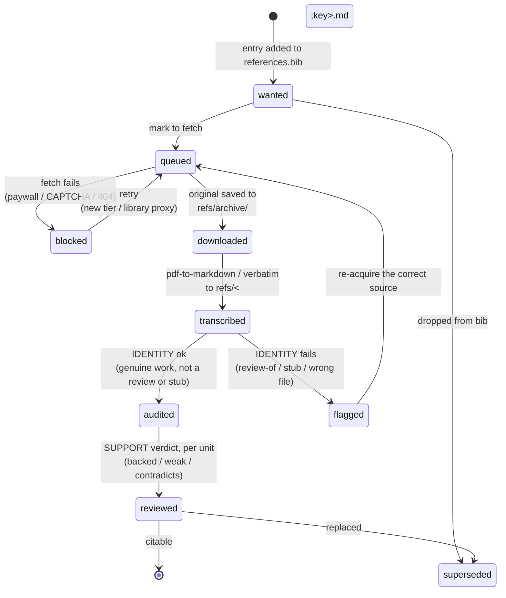

# Bib source lifecycle & the per-key audit log

How a bibliography source moves from "listed in `references.bib`" to "safe to
cite," and how that state is recorded so **multiple agents can audit over time
without clobbering each other**. This is the spec `./fw check-bib`
enforces; the human-readable rollup is that script's `--lifecycle` output, not a
committed report.

## State machine



Usage is an orthogonal axis, a property of a manuscript rather than a stage: a key is `cited` while a `[@key]` appears in a unit's `.qmd`, and `unused` otherwise. A key's tier is a third axis: it lives in one unit's `refs/` until `./fw refs promote <key>` moves it to `library/refs/` (see [`DESIGN.md`](DESIGN.md) § Sources).

### Three axes, not one ladder

The word "lifecycle" hides three independent dimensions. Conflating them is the
original modelling mistake; keep them separate:

1. **Acquisition** — sequential, with a `blocked` retry branch:
   `wanted → queued → downloaded → transcribed`. All derivable from the
   filesystem (`references.bib`, `refs/archive/<key>.*`, `refs/<key>.md`).
1. **Verification** — two *distinct* judgments, not one:
   - **identity**: is this transcript the cited work itself? (`genuine`) — or the
     wrong document (`review-of`, `wrong-file`), or too thin (`stub`, `missing`)?
   - **support**: does the source actually back the claim? (`backed` / `weak` /
     `contradicts`). Only meaningful once identity is `genuine`.
1. **Usage** — `cited` ⇄ `unused`, a property of the *manuscript*, found by grep.
   Orthogonal to everything above.

### The trust trap

`transcribed` is **not** a finish line. A book *review of* the work, dropped in
as `refs/<key>.md`, is real prose with real page markers — it passes every
mechanical check, and its own p.3 will even "back" a `[@key, 3]` locator. **No
byte-level check distinguishes the text of X from a faithful review of X.** Only
the recorded **identity** judgment catches it. Therefore: never treat
`transcribed` as verified, and default-deny anything without a `genuine` identity
verdict.

## The audit log — one append-only file per source

**`refs/audit/<key>.jsonl` is append-only. One JSON object per line, one line per
judgment. Never edit or delete a line — a correction is a *new* line with a later
`ts`.**

Per-key (not one central log) because the common concurrency case is *different
agents auditing different keys*: separate files → zero merge conflict. Same event
model as a central log, partitioned by the natural aggregate id (the cite key),
which also means everything about a source is reachable by its key
(`refs/<key>.md`, `refs/archive/<key>.*`, `refs/audit/<key>.jsonl`).

### Line schema

```json
{"ts":"2026-07-06T17:04:10+08:00","actor":"claude-opus-4-8","key":"harlow2019chokepoints","check":"identity","verdict":"genuine","evidence":"page-marked transcript, 240pp; pp. 7/21/26 checked against the original","supersedes":"2026-06-13T00:00:00+08:00"}
```

| field | meaning |
| :-- | :-- |
| `ts` | ISO-8601 with offset, taken from the system clock at write time (`date +%Y-%m-%dT%H:%M:%S%z`). Orders events; ties broken by `actor`. A hand-written timestamp in the future is the one error a later correction line cannot supersede. |
| `actor` | who judged (model id / person) — makes multi-agent runs attributable. |
| `key` | cite key (matches the filename). |
| `check` | `acquisition` \| `identity` \| `support`. |
| `unit` | **required on `support` lines**, absent on the others: the unit directory name (e.g. `03-paper-final`) whose claim was judged. `./fw check-bib <unit>` counts only that unit's support lines, because a verdict about the midterm's claim says nothing about the final paper's different claim. `identity` has no unit — it is a fact about the source, inherited by every unit. |
| `verdict` | identity: `genuine`\|`review-of`\|`stub`\|`wrong-file`\|`missing` · support: `backed`\|`weak`\|`contradicts` · acquisition: `downloaded`\|`transcribed`\|`blocked`\|`superseded`. |
| `evidence` | one-line justification (pages checked, why flagged). |
| `supersedes` | optional `ts` of the entry this replaces. |

### Rules

1. **Append-only.** Writes use append mode; never rewrite a committed line. The
   optional `check-bib.py --audit` guard diffs the file against `git show HEAD:`
   to reject history edits.
1. **Current state = newest line per `(key, check)`** by `ts`. That projection is
   the only thing consumers read; there is no stored "current state" to drift.
1. **Absence = untrusted.** A key with no `identity: genuine` line is not audited;
   under default-deny it cannot back a page locator.
1. **No consolidated report.** The rollup is `check-bib.py --lifecycle`, generated
   on demand, always current.

### Worked example — `harlow2019chokepoints`

Two events preserve the real history instead of overwriting it:

```
{"ts":"2026-06-13T00:00:00+08:00",...,"check":"identity","verdict":"stub","evidence":"source-note only; fulltext not transcribed"}
{"ts":"2026-07-06T17:04:10+08:00",...,"check":"identity","verdict":"genuine","evidence":"page-marked transcript, 240pp; pp. 7/21/26 checked against the original","supersedes":"2026-06-13T00:00:00+08:00"}
```

Newest wins → current identity is `genuine`; the trail shows who fixed it, when,
and from what.

## How `check-bib.py` projects & enforces

`audited` ⇔ newest `identity` is `genuine`; `reviewed` ⇔ newest `support` is
`backed`. `found`/`downloaded`/`transcribed`/`cited` stay filesystem/grep facts.

**Errors (exit 1):**
1. **MISIDENTIFIED** — cited key whose identity is `review-of`/`wrong-file` (wrong
   document; always fatal, even for a bare whole-work cite).
1. **UNBACKED PAGE LOCATOR** — a `[@key, N]` whose source is not `audited=genuine`,
   or whose page markers don't cover `N`.
1. **MISSING FULL TEXT** — cited key with no `refs/<key>.md`.

**Advisories (exit 0):**
- **CITED STUB (bare)** — `stub`/`missing` source cited whole-work with no page
  claim: a right-work-but-thin gap to close, not fatal.
- **CITED BUT UNAUDITED** — cited key with no identity verdict yet.
- **CITED BUT NOT `reviewed=backed`** — the claim-support review pass hasn't run
  (advisory until populated; the support gate hardens once reviews exist).
- **UNVERIFIED LOCATOR** — genuine source whose cited page falls outside the
  transcript's page-marker range. Usually a *printed↔physical offset*: pdf2md
  numbers markers by physical PDF sequence (`[Page 1 start]…`), but the citation
  uses the printed page (journal folio, `139 STAT. n`, Fed. Reg. column). Fix by
  recording the offset in the transcript's frontmatter (see below), not by
  re-transcribing.
- **LOG↔FILESYSTEM DRIFT** — the audit verdict disagrees with the `.md` (re-audit).

The graduation that matters: `review-of`/`wrong-file` (wrong document) is always
fatal; `stub`/`missing` (right work, thin) is fatal only when a page locator
leans on it — otherwise advisory.

## Asserting quality: levels + the ratchet

An *audit* is open-ended and never converges; an *assertion* is true or false and
can be enforced. A large dirty base is cleaned by asserting a **level** and
ratcheting it up, not by chasing "perfect." Levels are scoped to *cited* keys;
each subsumes the prior:

| level | name | met when (every cited key) |
| :-- | :-- | :-- |
| **L0** | resolvable | resolves in `references.bib`, format clean — *check-citations.py's gate* |
| **L1** | has-local-text | has a `refs/<key>.md` |
| **L2** | genuine-identity | newest `identity` verdict is `genuine` (no stub / wrong-doc / unaudited) |
| **L3** | locators-backed | every `[@key, p]` resolves against page markers (offset-mapped) |
| **L4** | claims-supported | newest `support` verdict is `backed` |

### `refs/<key>.md` frontmatter — `marker_offset`

A transcript may carry an optional flat-YAML frontmatter block. The field that
L3 reads is **`marker_offset`**: `printed_page = physical_marker + marker_offset`.
pdf2md emits physical markers (`[Page 1 start]`, `[Page 2 start]`, …); when a
source's printed pages differ (an article that begins on folio 919, a slip law
paginated `139 STAT. 419`, a Federal Register issue starting at column 48295),
set the offset once and every `[@key, p]` is checked against the *printed* range
`[min+offset, max+offset]`. Unset ⇒ offset 0 (printed == physical). Derive it by
finding a printed page number in a running header and subtracting its physical
marker (e.g. physical page 2 shows folio “920” ⇒ `marker_offset: 918`).

```yaml
---
marker_offset: 918   # printed = physical + 918  (W&M Law Rev 64(4), phys 1 = printed 919)
local_status: fulltext
---
```

The second field, **`local_status`** (`fulltext` | `stub`), is the *authoritative*
full-text classification for that key. Without it, `check-bib.py` falls back to a
phrase heuristic (scan the head for stub markers like "source-role note only") —
a guess that mis-fires once a stub note is fleshed out into prose, or when real
prose happens to quote a stub phrase. Declaring `local_status` retires the
heuristic **for that key**: a deliberate classification is never re-guessed. The
heuristic survives only for keys that carry no `local_status` yet.

- `./fw check-bib <unit> --todo` → the exact keys blocking the *next* level:
  the finite, shrinking worklist that makes convergence visible.
- `./fw check-bib <unit> --assert=L2` → exit 1 unless the cited set meets L2
  (bare `--assert` reads `required_bib_level` from `WORK.json`).
- **The ratchet.** `WORK.json:required_bib_level` is the floor; `./fw build`
  refuses to build a `paper`/`journal`/`thesis` below it (override once with
  `--no-bib-gate`). Set the floor to what you've *achieved*, raise it as you
  clean. Once raised, a newly-added dirty key fails the build — dirt can't
  re-enter, so the next audit only ever faces genuinely new keys. That is what
  turns N non-converging audits into one convergent process.

`init.py` seeds `required_bib_level: 1` for new citation-bearing works.
